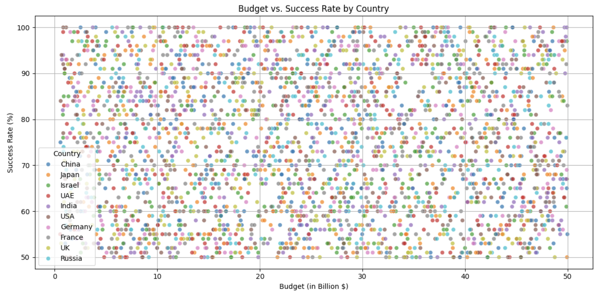
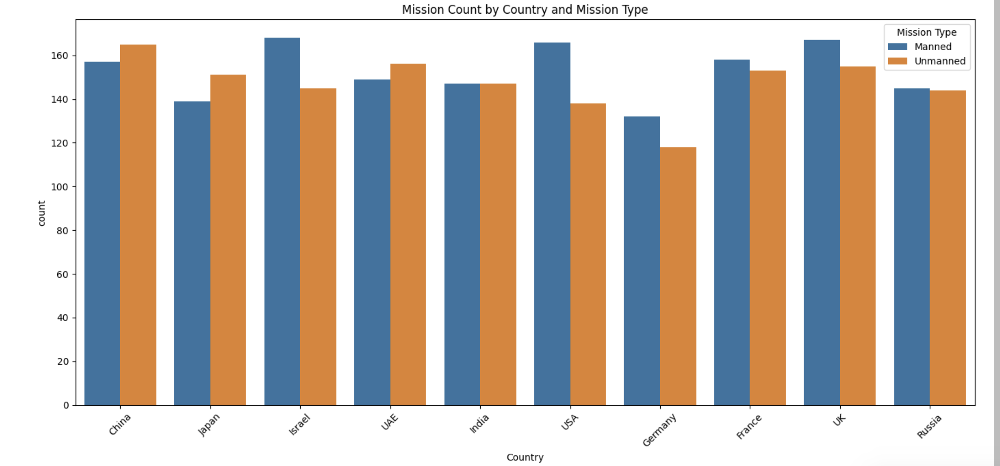
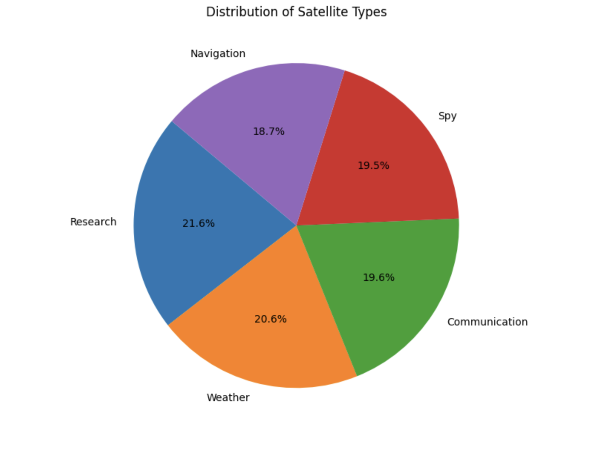
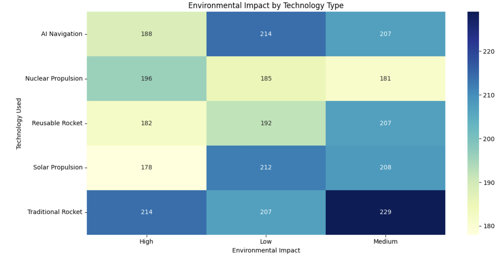
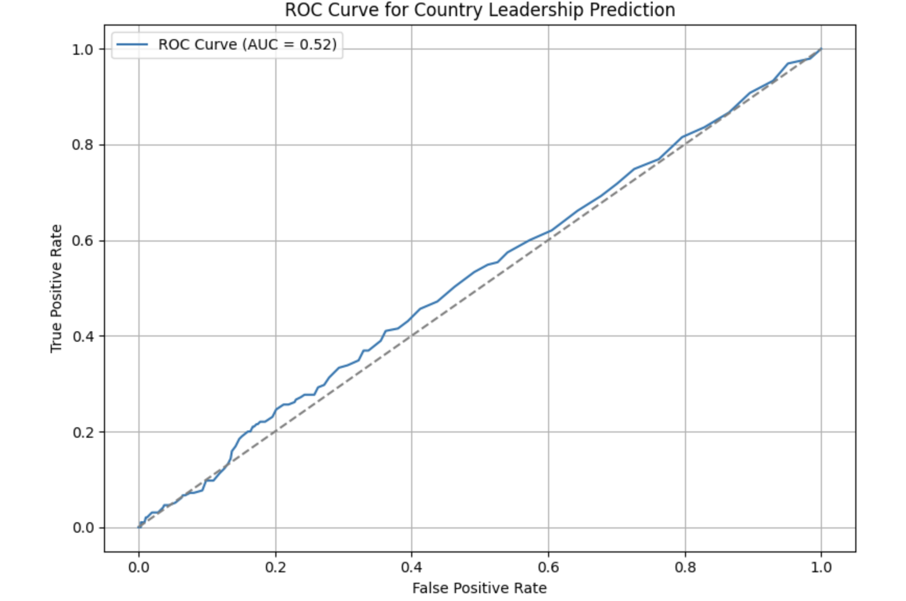

# 🚀 Race to Mars: Global Space Exploration Analysis

## Author

**Darious Brown**

- GitHub: https://github.com/Dare215
- LinkedIn: https://www.linkedin.com/in/dariousbrown
- Portfolio: https://dare215.github.io/DariousBrown-Portfolio/

---

## Project Overview

This project explores global space exploration trends using data analytics, visualization, and machine learning.

The analysis investigates:

- Space mission budgets
- Mission success rates
- Mission type distributions
- Satellite deployment trends
- Environmental impacts of space technologies
- Predictive modeling to identify leading space nations

The project combines exploratory data analysis (EDA) with supervised machine learning techniques to better understand the evolving global space race.

---

## Business Objectives

- Analyze mission success rates across countries.
- Identify relationships between funding and mission performance.
- Evaluate satellite deployment trends.
- Examine environmental impacts of emerging technologies.
- Predict leadership within the global space exploration landscape.

---

## Technologies Used

- Python
- Pandas
- NumPy
- Matplotlib
- Seaborn
- Scikit-Learn
- Plotly
- Jupyter Notebook

---

## Machine Learning

A Random Forest Classifier was developed to predict country leadership within the space exploration ecosystem.

Evaluation metrics included:

- ROC Curve
- AUC Score
- Classification Analysis

---

## Visualizations

### Budget vs Success Rate by Country

---

### Mission Count by Country and Mission Type

---

### Distribution of Satellite Types

---

### Environmental Impact by Technology Type

---

### Random Forest ROC Curve

---

## Key Findings

- Mission budgets alone were not strong predictors of mission success.
- Both manned and unmanned missions remain heavily utilized among leading countries.
- Communication and research satellites represented major portions of deployments.
- Environmental impacts varied significantly across propulsion technologies.
- Predictive modeling demonstrated the potential to classify leadership trends using mission characteristics.

---

## Repository Structure

